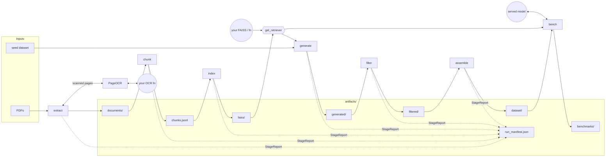
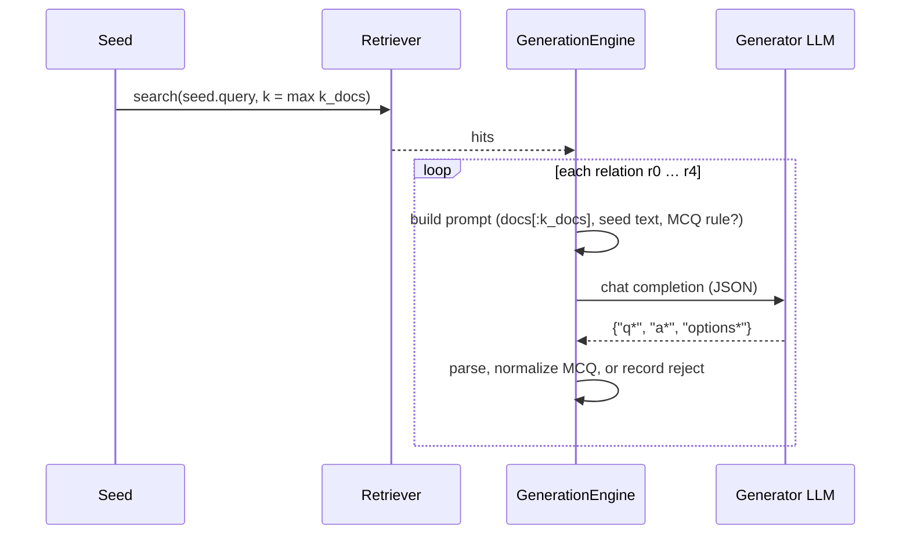
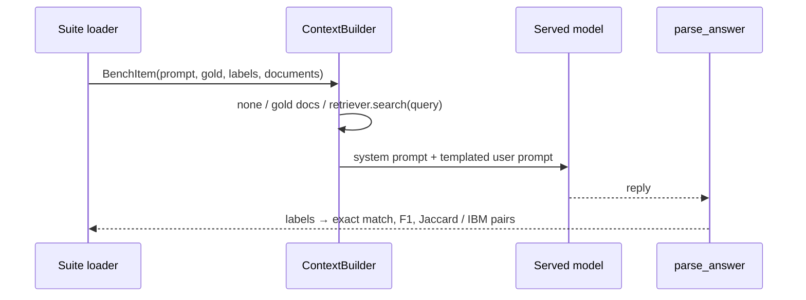

# Architecture

## Data flow

## Design principles

**Stages communicate through files.** Each stage reads the previous stage's
artifacts and writes its own, at paths from `config.paths`. Any stage can be
re-run alone, and every intermediate result can be read.

**One config object.** `config.Config` holds every setting as pydantic
models, one class per YAML section, with `extra="forbid"`. Nothing is
hard-coded in code: endpoints, model names, paths and prompt text all come
from config or prompt files. `Config.fingerprint()` hashes the whole thing
for the manifest.

**Reports, not silence.** Every stage returns a `StageReport` (inputs,
outputs, rejected, errors, details), which `Pipeline` writes to
`run_manifest.json` after each stage. Per-item failures (an OCR page, an
LLM reply, a benchmark request) are isolated and recorded, never fatal.
Configuration errors fail before any work starts.

**Plug-ins by name or import path.** OCR backends, retrievers,
extractors, embedders and benchmark suites have registries. OCR backends
and retrievers can also be given as `module:function` or
`file.py:function` (`utils/plugins.load_callable`). A factory variant
lets a plug-in set itself up once per run.

**Optional dependencies are lazy.** Heavy libraries (PyMuPDF, FAISS,
sentence-transformers, datasets) are imported inside the functions that need
them, so `import industrial_instruction` needs only the core dependencies.

## Modules

| Module | Responsibility |
|---|---|
| `config.py` | all settings; `Config.from_yaml`, `with_override`, `fingerprint` |
| `schemas.py` | `Document`, `Chunk`, `Seed`, `QASample`, `RelationSpec`, `StageReport` |
| `pipeline.py` | stage order, the manifest |
| `cli.py` | the `ii` command: a thin layer over `Pipeline` and `benchmark` |
| `extract/` | PDF → markdown; `base.Extractor` also carries the shared OCR hooks |
| `ocr/` | the `OCRPage` contract, registry, and `PageOCR` (concurrency, cache, isolation) |
| `chunk/` | heading-aware and fixed chunking |
| `embed/` | embedding backends behind one `Embedder` interface (separate query/document prefixes) |
| `store/` | `FaissStore`, `get_retriever` (index / faiss / function), `index_corpus` |
| `generate/` | `GenerationEngine`, prompts, seeds, multiple-choice normalization, LLM client |
| `filter/` | `RuleFilter`, the LLM judge |
| `assemble/` | splits, flat and chat formats, Hub upload |
| `benchmark/` | suites, served-model `Endpoint`, `ContextBuilder`, answer parsing, metrics |
| `utils/` | jsonl/hash IO, logging, plug-in loading |

## The generation loop

## The benchmark loop

