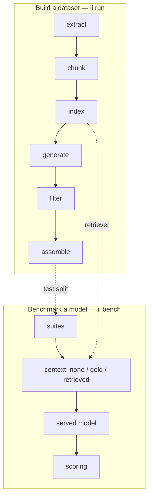

# User guide

The package has two halves, which share one configuration file and one
retriever.



| Stage | Command | Reads | Writes |
|---|---|---|---|
| [Extract](extract.md) (+ [OCR](ocr.md)) | `ii extract` | `data/pdfs/` | `artifacts/documents/` |
| [Chunk](chunking-indexing.md) | `ii chunk` | documents | `artifacts/chunks.jsonl` |
| [Index](chunking-indexing.md) | `ii index` | chunks | `artifacts/faiss/` |
| [Generate](generation.md) | `ii generate` | [seeds](seeds.md), [retriever](retrieval.md) | `artifacts/generated/` |
| [Filter](filtering.md) | `ii filter` | generated | `artifacts/filtered/` |
| [Assemble](assemble.md) | `ii assemble` | filtered | `artifacts/dataset/` |
| [Benchmark](benchmarking.md) | `ii bench` | suites, served model | `artifacts/benchmarks/` |

Stages talk to each other only through files in `artifacts/`. You can run
one stage, read its output, change a setting and run it again without
repeating the stages before it.

```bash
ii run                                    # all stages, in order
ii run --stages generate,filter,assemble  # a subset (always run in pipeline order)
```
