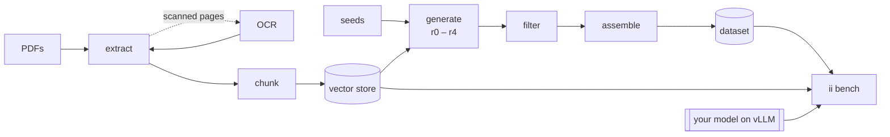

---
hide:
  - navigation
---

<div class="ii-hero" markdown>

# Industrial-Instruction

<p class="lead">Turn a folder of technical PDFs into a retrieval-grounded instruction dataset, then benchmark any model you serve on it, on IBM's FailureSensorIQ, and on the paper's test splits.</p>

[Get started :material-arrow-right:](getting-started/quickstart.md){ .md-button .md-button--primary }
[Read the paper :material-file-document:](https://arxiv.org/abs/2608.22817){ .md-button }

</div>



<div class="grid cards" markdown>

-   :material-file-pdf-box:{ .lg .middle } **PDF → clean markdown**

    ---

    Headings from font sizes, tables written once at their place on the
    page, headers and footers removed. Scanned pages go to **any OCR model
    you attach as one function**.

    [:octicons-arrow-right-24: Extraction](guide/extract.md) · [OCR](guide/ocr.md)

-   :material-database-search:{ .lg .middle } **Your retrieval, your way**

    ---

    Build a FAISS store from your corpus in one command, bring an index you
    already have (including the paper's), or plug in your own search
    service.

    [:octicons-arrow-right-24: Retrieval](guide/retrieval.md)

-   :material-robot-outline:{ .lg .middle } **Five retrieval relations**

    ---

    For every seed question the generator writes samples whose documents
    range from useless (r0) to required for multi-hop answers (r4), so
    models learn when to trust context.

    [:octicons-arrow-right-24: Generation](guide/generation.md)

-   :material-filter-check:{ .lg .middle } **Nothing dropped silently**

    ---

    Rule checks and an optional LLM judge. Every rejected sample keeps its
    reason and raw output; every run is fingerprinted in a manifest.

    [:octicons-arrow-right-24: Filtering](guide/filtering.md)

-   :material-speedometer:{ .lg .middle } **Benchmark a served model**

    ---

    Point `ii bench` at vLLM. Suites: IBM FailureSensorIQ, the paper's Qwen
    and Claude test splits, your own test split, or any custom set, with or
    without documents.

    [:octicons-arrow-right-24: Benchmarking](guide/benchmarking.md)

-   :material-puzzle-outline:{ .lg .middle } **Plug in anything**

    ---

    OCR models, retrievers, extractors, embedders, benchmark suites and
    prompts are registered by name, or given as `module:function` in the
    config.

    [:octicons-arrow-right-24: Python API](reference/python-api.md)

</div>

## In three commands

```bash
pip install -e '.[pdf,local-embed,faiss,bench]'
ii init && cp ~/manuals/*.pdf data/pdfs/
ii run --set seeds.limit=20
```

The dataset is in `artifacts/dataset/`. Benchmark a model served with vLLM:

```bash
ii bench --base-url http://localhost:8000/v1 --suite ibm --suite generated
```

!!! note "Scope"
    The package **builds datasets** and **benchmarks models**. It does not
    train; the dataset it writes (`train.jsonl`, `train.chat.jsonl`) works
    with any trainer, such as TRL, Unsloth or axolotl.
